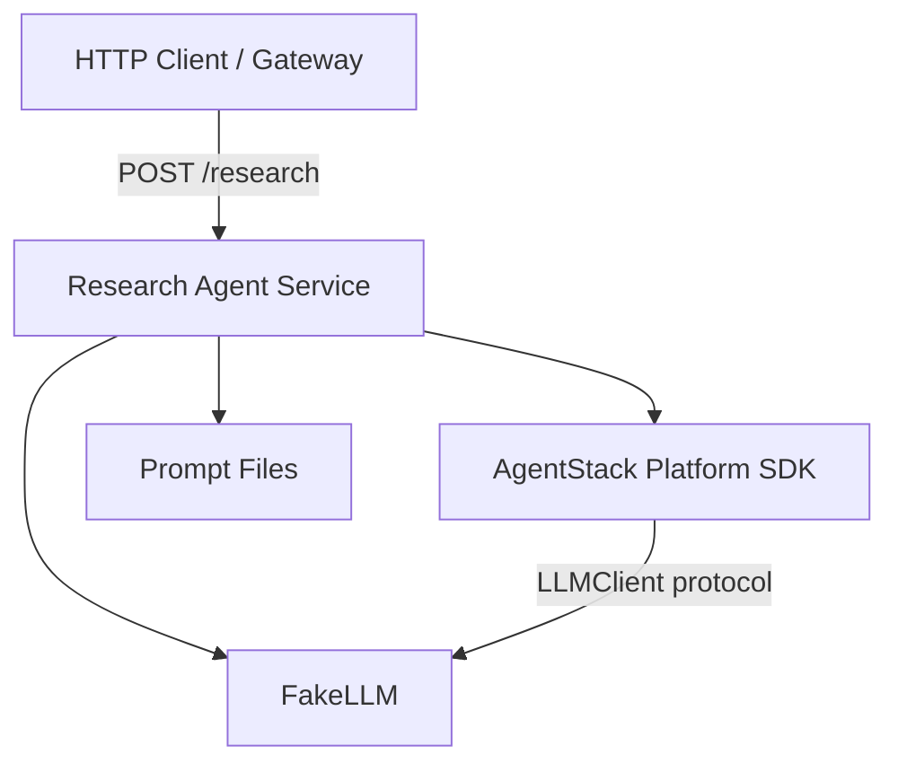
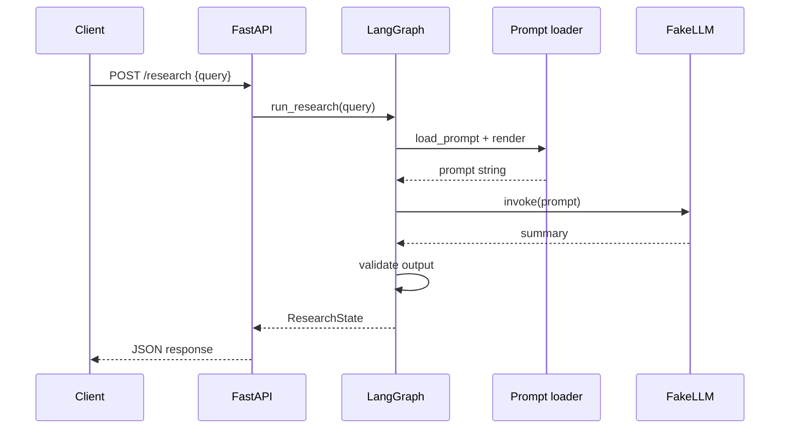

# Architecture

AgentStack separates shared platform code from individual agent services so new agents can be added without duplicating infrastructure concerns.

## High-level architecture

## Layering

| Layer | Location | Responsibility |
|-------|----------|----------------|
| Transport | `agents/*/app.py` | HTTP routing, request/response models |
| Workflow | `agents/*/graph.py` | LangGraph state machine |
| LLM adapter | `agents/*/fake_llm.py` | Deterministic model stub (swap for real LLM later) |
| Platform SDK | `platform/agentstack/` | Config, logging, shared models, abstractions |

## Research agent sequence

## Scaling to multi-agent

Future agents follow the same pattern under `agents/<name>/`, reusing `platform/agentstack`. A gateway or supervisor (Milestone 3+) will route requests without changing individual agent internals.

See [ADR 001](adr/001-repository-structure.md) for structural decisions.
